# 4.2 深入了解圆角属性border-radius

## 4.2.1 了解border-radius属性的语法

我们平时使用的`border-radius`属性其实是一种缩写，它是`border-top-left-radius`、`border-top-right-radius`、`border-bottom-left-radius`和`border-bottom-right-radius`这4个属性的缩写。这4个属性的圆角位置如图所示。


### 1．1～4个值表示的方位

`border-radius`属性支持`1～4`个值，分别表示不同的角。

- 如果只有1个值，则表示圆角效果作用在`全部4个角`，效果如图4-6所示，代码如下：

```css
border-radius: 10px;
```


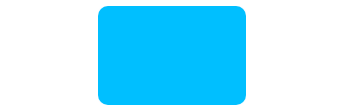

**图4-6 只有1个值时的圆角效果示意**

<br/>

- 如果有2个值，则第一个值作用于`左上角`和`右下角`，第二个值作用于`右上角`和`左下角`，效果如图4-7所示，代码如下：

```css
border-radius: 10px 50%;
```


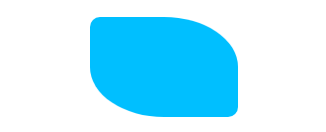

**图4-7 有2个值时的圆角效果示意**

<br/>

- 如果有3个值，则第一个值作用于`左上角`，第二个值作用于`右上角`和`左下角`，第三个值作用于`右下角`，效果如图4-8所示，代码如下：

```css
border-radius: 10px 50% 30px;
```


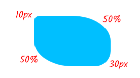

**图4-8 有3个值时的圆角效果及标注示意**

<br/>

- 如果有4个值，则4个值按照`顺时针`方向依次作用于`左上角`、`右上角`、`右下角`和`左下角`，效果如图4-9所示。

```css
border-radius: 10px 50% 30px 0;
```


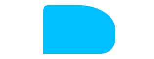

**图4-9 有4个值时的圆角效果示意**

<br/>

### 2．水平半径和垂直半径

我们平时使用的圆角值也是一种`缩写`。例如，下面CSS代码中的`10px`就是一种缩写：

```css
border-top-left-radius: 10px;
```

它等同于：

```css
border-top-left-radius: 10px 10px;
```

其中，第一个值表示`水平半径`，第二个值表示`垂直半径`。又如：

```css
border-top-left-radius: 30px 60px;
```

表示`左上角`的圆角是由`水平半径（短半轴）`为30px、`垂直半径（长半轴）`为60px的椭圆产生的，效果如图4-10所示。


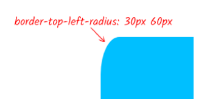

**图4-10 border-top-left-radius:30px 60px效果示意**

<br/>

如果是`border-radius`属性，则`水平半径`和`垂直半径`不是通过`空格`进行区分，而是通过`斜杠`区分。例如：

```css
border-radius: 30px / 60px;
```

表示4个角落的圆角的`水平半径`都是30px，`垂直半径`都是60px，效果如图4-11所示。


**图4-11 border-radius:30px/60px效果示意**

<br/>

斜杠前后都支持`1～4`个长度值。因此，下面的语法都是合法的：

```css
/* 左上 右上+左下 右下 / 左上 右上+左下 右下 */
border-radius: 10px 5px 2em / 20px 25px 30%;
/* 左上+右下 右上+左下 / 左上 右上 右下 左下 */
border-radius: 10px 5% / 20px 25em 30px 35em;
```

## 4.2.2 弄懂圆角效果是如何产生的

虽然我们口头上都称`border-radius`为圆角属性，实际上`border-radius`属性的字面意思不是“圆角”，而是“边界半径”，也就是圆角效果来自以这个半径值绘制的圆或以半轴值绘制的椭圆。例如，图4-10所示左上角的圆角效果是由水平半径为30px、垂直半径为60px的椭圆产生的，原理如图4-12所示。


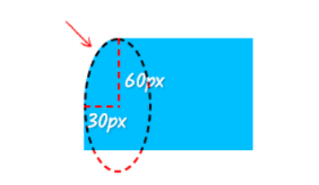

**图4-12 border-radius:30px 60px效果和原理示意**

<br/>

如果进一步放大半径值，例如设置`垂直半径大小`和元素等高，也就是`100%`高度值，如下所示：

```css
border-top-left-radius: 30px 100%;
```

效果和原理此时如图4-13所示。


**图4-13 border-radius:30px 100%效果和原理示意**

<br/>

**重叠曲线的渲染机制**

`左上角`和`左下角`的垂直半径都是`100%`，代码如下：

```css
border-top-left-radius: 30px 100%;
border-bottom-left-radius: 30px 100%
```


<br/>

```css
border-top-left-radius: 30px 100%;
border-bottom-left-radius: 30px 100%;
```

实际上，这等同于：

```css
border-top-left-radius: 15px 50%;
border-bottom-left-radius: 15px 50%;
```

此时会有图4-14所示的效果。


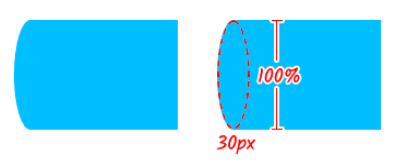

**图4-14 曲线重叠下的渲染效果示意**

<br/>

明白了重叠曲线的渲染机制，一些常见却不太理解的现象也就明白了。

如果元素的高度和宽度是一样的，例如都是150px，则下面两段CSS声明的效果是一样的：

```css
border-radius: 100%;
border-radius: 150px;
```

但是，如果元素的高度和宽度是不一样的，例如宽度是150px，高度是100px，则下面两段CSS声明的效果就不一样：

```css
border-radius: 100%;
border-radius: 150px;
```

效果如图4-15所示。


**图4-15 百分比值和长度值在曲线重叠下的渲染差异示意**

<br/>

为什么会不一样呢？很多人百思不得其解。其实，简单套用一下重叠曲线的算法，一切就豁然开朗了：


<br/>

## 4.2.3 border-radius属性渲染border边框的细节

如果元素设置了`border`边框，则`圆角半径`会被分成`内半径`和`外半径`，如图4-16所示。


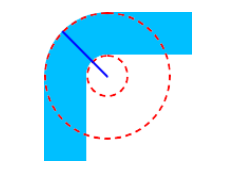

**图4-16 内半径和外半径示意**

<br/>

其中直线为外半径，圆心到内部虚线圆的距离为内半径。

（1） `padding`边缘的圆角大小为设置的`border-radius`大小减去`边框的厚度`，如果结果为负，则内半径为0。例如：

```css
.radius {
 width: 100px; height: 100px;
 border-top: 40px solid deepskyblue;
 border-left: 40px solid deepskyblue;
 border-radius: 40px 0 0;
}
```

圆角半径大小和边框的大小均是`40px`，此时内半径大小为`0`，因此，padding边缘是直角，没有弧度。最终效果如图4-17所示。


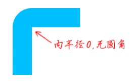

**图4-17 内半径为0示意**

<br/>

此特性在边框颜色透明的场景下依旧适用。另外，当内半径`大于0`的时候边框会和`padding box`重叠，此时文字内容可能会出现在边框之上。

<br/>

（2） 如果相邻两侧边框的厚度不同，则圆角大小将在较厚和较薄边界之间显示平滑过渡。例如：

```css
.radius {
 width: 100px; height: 100px;
 border-top: 40px solid deepskyblue;
 border-left: 20px solid deepskyblue;
 border-radius: 40px 0 0 / 60px 0 0;
}
```

最终效果如图4-18所示。可以明显看出在圆角位置处，边框的厚度在`20px～40px`范围内变化的时候是平滑的，是流畅的。


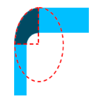

**图4-18 边框厚度平滑过渡示意**

<br/>

我们可以利用这一特性实现图4-24所示的带尾巴的小尖角效果。

<br/>

（3）圆角边框的连接线和直角边框连接线位置一致，但是角度会有所不同。例如：

```css
 width: 100px; 
 height: 100px;
 border-top: 40px solid deepskyblue;
 border-left: 20px solid deeppink;
 border-right: 20px solid deeppink;
 border-radius: 40px 0 0 / 60px 0 0;
 ```

 最终效果如图4-19所示。


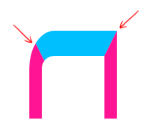

**图4-19 圆角和直角边框连接处细节示意**

<br/>

下面是其他一些细节。

- `border-radius`不支持负值。
- 圆角以外的区域不可点击，无法响应`click`事件。
- `border-radius`没有继承性，因此父元素设置了`border-radius`，子元素依然是直角效果。我们可以通过给父元素设置`overflow:hidden`让子元素视觉上表现为圆角。
- `border-radius`属性支持`transition`过渡效果，也支持`animation`动画效果，因此在图形表现领域，`border-radius`属性会非常给力。
- `border-radius`属性也是可以应用于`display`的计算值为`table`、`inline-table`或者`table-cell`的元素上的，但是有一个前提，那就是表格元素的`border-collapse`属性值需要是`separate`（separate是border-collapse属性的默认值），如果`border-collapse`属性值是`collapse`，那么是没有圆角效果的。

## 4.2.4 border-radius属性的高级应用技巧

`border-radius`在实际开发中的高级应用主要在两方面，一个是增强原本的圆角效果，另外一个就是绘制各类图形效果。

### 1．border-radius与不规则圆角头像

我们平时给头像设置的圆角效果都是规则的圆，其实还可以使用百分比值设置不同的水平半径和垂直半径，实现不规则的圆角效果，例如：

```css
.avatar {
 border-radius: 70% 30% 30% 70% / 60% 40% 60% 40%;
}
```

效果如图4-20所示。


**图4-20 不规则圆角头像效果示意**

<br/>

[**案例：不规则圆角头像**](https://demo.cssworld.cn/new/4/2-1.php)

如果是很多个头像，我们还可以利用“蝉原则”（质数）实现随机圆角效果。
- 一种方法是直接指定圆角大小，`IE9+`浏览器均提供支持，例如：

```css
.avatar { 
 border-radius: 87% 91% 98% 100%;
}
.avatar:nth-child(2n+1) {
 border-radius: 59% 52% 56% 59%;
}
.avatar:nth-child(3n+2) {
 border-radius: 84% 94% 83% 72%;
}
.avatar:nth-child(5n+3) {
 border-radius: 73% 100% 82% 100%;
}
.avatar:nth-child(7n+5) {
 border-radius: 93% 90% 85% 78%;
}
.avatar:nth-child(11n+7):hover {
 border-radius: 58% 98% 78% 83%;
}
```

- 另外一种方法是选取圆角动画中的某一帧，这可以借助`animation-delay`负值技术实现，例如：

```css
.avatar {
 border-radius: 50%;
 animation: morph 6s paused linear;
}
@keyframes morph {
 0% { border-radius: 40% 60% 60% 40% / 60% 30% 70% 40%; }
 100% { border-radius: 40% 60%; } 
}
.avatar:nth-child(2n+1) {animation-delay: -1s;}
.avatar:nth-child(3n+2) {animation-delay: -2s;}
.avatar:nth-child(5n+3) {animation-delay: -3s;}
.avatar:nth-child(7n+5) {animation-delay: -4s;}
.avatar:nth-child(11n+7) {animation-delay: -5s;}
```

最终可以实现图4-22所示的随机不规则圆角头像效果，支持任意数量的头像。


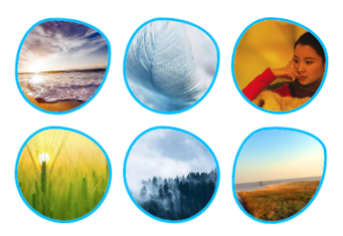

**图4-22 随机不规则圆角头像效果示意**

<br/>

[**案例：随机不规则圆角头像**](https://demo.cssworld.cn/new/4/2-2.php)

### 2．border-radius图形绘制技巧

只要是带圆弧的图形效果，`border-radius`属性都能绘制出来，前提是对`border-radius`属性有足够深入的了解。

[**案例：border-radius图形绘制技巧**](https://demo.cssworld.cn/new/4/2-3.php)