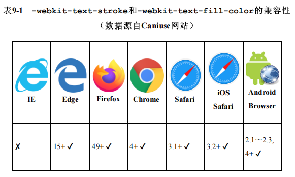
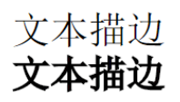
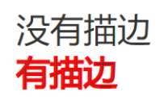
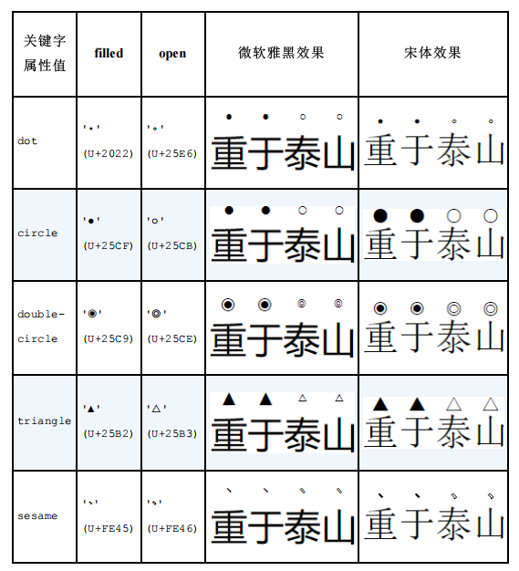
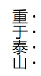
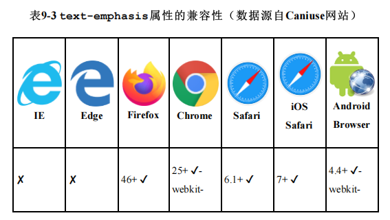

<!-- # 9.1 文字的美化与装饰 -->

## 9.1.1 文字阴影属性text-shadow

`text-shadow`是文字阴影，`box-shadow`是盒阴影，两者语法类似，但仍有两点区别。

- text-shadow不支持`inset`关键字，也就是text-shadow只有外阴影，没有内阴影。
- text-shadow不支持`阴影扩展`，也就是text-shadow最多支持3个数值，分别表示`水平偏移`、`垂直偏移`和`模糊大小`，例如：

```css
/* 分别往右方、下方偏移1px，同时模糊2px */
text-shadow: 1px 1px 2px black;
```

而`box-shadow`属性最多支持4个数值。

除了上面两点区别，text-shadow和box-shadow属性的其他语法特性都是一样的，包括支持任意数量的`阴影叠加`。我们可以利用这一特性实现文字3D立体投影效果，例如：

```css
<span class="text-shadow-3d">立体投影</span>

.text-shadow-3d {
 font-size: 60px;
 color: deepskyblue;
 text-shadow: 1px 1px #005A79, 2px 2px #005A79, 3px 3px #005A79, 4px 4px #005A79, 
              5px 5px #005A79, 6px 6px #005A79, 7px 7px #005A79, 8px 8px #005A79;
}
```

实现的效果如图9-1所示。


**图9-1 文字3D立体投影效果示意**

<br/>

利用这一特性也可以实现文字外描边效果，例如：

```css
<p class="text-stroke-out">外描边</p>

.text-stroke-out {
 font-size: 60px;
 color: #fff;
/* 如果描边宽度只有1px，则只需要4个方向的偏移，
因为这里描边宽度为2px，所以使用了8个方向的偏移 */
 text-shadow: 0 2px deeppink, 2px 0 deeppink, 0 -2px deeppink, -2px 0 deeppink, 
 2px 2px deeppink, -2px -2px deeppink, -2px 2px deeppink, 2px -2px deeppink;
}
```

实现的效果如图9-2所示。


**图9-2 文字外描边效果示意**

<br/>

[**查看案例**](https://demo.cssworld.cn/new/9/1-1.php)

text-shadow属性可以在`::first-line`和`::first-letter`这两个伪元素中生效。`IE9`浏览器并不支持text-shadow属性，从`IE10`浏览器才开始支持该属性。

## 9.1.2 文字描边属性text-stroke

接下来介绍两个非标准但比较实用的CSS属性：`text-stroke`和`text-fill-color`。顾名思义，两者分别用来实现`文字描边`效果和`文字颜色填充`效果。

**兼容性**

`-webkit-text-stroke`和`-webkit-text-fill-color`的兼容性如表9-1所示。





<br/>

目前没有任何浏览器支持不需要`-webkit-`私有前缀的语法。另外，`text-stroke`和`text-fill-color`属性的兼容性在移动端非常好。

### 1．text-stroke属性的语法

`text-stroke`属性的语法并不复杂，它与`border`和`background`属性类似，是若干个CSS属性的缩写。

text-stroke属性是`text-stroke-width`和`text-stroke-color`这两个CSS属性的缩写，分别表示文字描边的宽度和文字描边的颜色。有别于border属性，text-stroke属性无法指定文字描边的类型，只支持`实线描边`，不支持`点线`或者`虚线描边`，也无法指定描边是`外描边`还是`内描边`或`居中描边`（SVG描边中的stroke属性支持`虚线描边`和`外描边`）。该属性的语法简单示意如下：

```css
.stroke {
 -webkit-text-stroke: 2px red;
}
```

等同于：

```css
.stroke {
 -webkit-text-stroke-width: 2px;
 -webkit-text-stroke-color: red;
}
```

text-stroke属性的另外一个和border属性的不同之处是`宽度的默认值`。border-width属性的宽度默认值是`medium`，最终表现等同于设置值为`3px`，但是text-stroke-width属性的宽度
默认值却是`0`（虽然text-stroke-width属性也支持medium关键字），这就意味着，当我们使用text-stroke属性的时候，是一定要设置描边的宽度值的。

至于描边的颜色，理论上可以不设置。但是由于描边的颜色默认是`color`属性的计算值，和文字自身的颜色一致，因此，如果不设置描边的颜色，最终的样式表现并不是描边，而是文字`加粗`效果，例如：

```css
.stroke {
 font-size: 40px;
 -webkit-text-stroke: 2px;
}
```

实现的效果如图9-3所示。




**图9-3 文字描边产生的加粗效果示意**

<br/>

实际开发的时候，确实存在需要使用特别粗的文字来表示强调的场景，因此上面的案例还是有一定的使用价值的。

### 2．text-stroke是居中描边

在日常开发中，文字的笔画粗细都是`1px～2px`，如果此时再设置一个居中描边效果，文字原本的颜色几乎都会被描边颜色覆盖，效果会很糟糕。例如下面这个例子，设置了`40px`粗细的文字和`2px`粗细的描边效果：

```css
.stroke {
 font-size: 40px;
 -webkit-text-stroke: 2px red;
}
```

结果如图9-4所示。可以看到，下方设置了描边的文字中原本的黑色只剩丝丝残余，因为描边的一半，也就是`1px`粗细的红色描边覆盖了原本的黑色文字轨迹，所以最终的效果就变得有些奇怪。




**图9-4 文字描边是居中描边效果示意**

<br/>

我们实际开发更需要的则是`外描边`效果。不过存在即合理，虽然text-stroke属性无法实现我们预想的描边效果，但是可以用来实现`削弱文字字重`的效果。

### 3．text-stroke实现低字重字体效果

现代开源字体，例如`思源黑体`、`思源宋体`和`苹方`等字体，都有`丰富的字重`，给字体设置font-weight:100和font-weight:400后可以明显看出文字的笔画粗细不一样；但是对于`微软雅黑`字体，由于其`缺失字重`，设置font-weight:100和font-weight:400渲染出来的文字效果都是一样的，笔画都是正常粗细。

设置字体笔画的粗细在macOS中很好实现，因为苹方等字体字重丰富；而在用户使用率最高的Windows操作系统中，内置的中文字体字重缺失，就无法渲染出`极细`的文字。有了`text-stroke`的居中描边特性，理论上，在Windows操作系统中就有了字重缺失的解决方案。方法就是将描边颜色设置成和文字所在的背景色一样的颜色。

图9-5就是在Chrome浏览器1倍屏中不同描边宽度的渲染效果图。


**图9-5 Chrome浏览器1倍屏中文字描边后的粗细效果示意**

<br/>

可以看到文字笔画确实变细了，但同时文字看起来变淡了，或者说文字变淡让文字看起来更细了。出现这种效果的原因很简单，即`屏幕密度太低`。屏幕最小的显示单位为`1px`，所以，要想使描边宽度小于1px的描边效果生效，就需要用特殊的文字边缘渲染算法进行视觉上的处理，这种算法处理就会导致文字颜色看起来比较淡。

[**text-stroke与文字font-weight字重变细实例页面**](https://demo.cssworld.cn/new/9/1-2.php)

如果屏幕密度较高，例如iMac的5K屏幕和手机屏幕，渲染出的效果就会很理想。
例如，在3倍屏的Android手机中，最终的渲染效果如图9-6所示（1/2缩放大小）。


**图9-6 Android手机3倍屏中文字描边后的粗细效果示意**

<br/>

因此，text-stroke属性在让文字笔画变细并降低文字字重的技术上是没有任何问题的，关键就看用户的显示器的屏幕密度是否足够。移动端项目使用此技术没有任何顾虑；如果是桌面端项目，用户的显示设备一般都是普通的1倍屏显示器，因此建议在文字字号较大的场景中使用该技术，效果会好很多。

如果想要实现文字的`外描边`效果，一种方法是使用`text-shadow`属性模拟，这一点在9.1.1节已经展示过了。不过text-shadow实现的并不是真正的外描边效果，因为一个矩形四面投影的时候，4个边角实际上会有`空隙`，如果再加上4个边角的投影以修复间隙的问题，又会有重复投影的问题。实际上，使用`text-stroke`属性是可以实现效果更好的外描边效果的，只是操作上要复杂一些，`不适合大段文字`的场景。实现该效果的原理很简单：**设置两层文字，下层的文字有描边，上层的文字没有描边**。例如：

```css
<span class="text-stroke-out" data-content="外描边">外描边</span>

.text-stroke-out {
 font-size: 60px;
 -webkit-text-stroke: 4px deeppink;
 letter-spacing: 4px;
}
[data-content]::before {
 content: attr(data-content);
 position: absolute;
 -webkit-text-stroke: 0;
 color: deepskyblue;
}
```

[**text-stroke与文字外描边效果实例页面**](https://demo.cssworld.cn/new/9/1-3.php)

## 9.1.3 文字颜色填充属性text-fill-color

使用`text-fill-color`属性可以对文字进行`颜色填充`，还可以覆盖color属性设置的颜色，注意，只是覆盖color的渲染表现，实际上元素的颜色计算值还是由color属性决定的。

text-fill-color属性的语法使用示意如下：

```css
-webkit-text-fill-color: transparent;
-webkit-text-fill-color: deepskyblue;
-webkit-text-fill-color: #228bff;
-webkit-text-fill-color: rgba(100, 200, 0, .6);
```

[**text-fill-color与渐变图像、常规图像文字填充效果实例页面**](https://demo.cssworld.cn/new/9/1-4.php)

`text-fill-color`属性还有另外一个作用，那就是在改变文字颜色的同时保护`color`属性。为什么color属性需要被保护呢？主要有以下两个原因。

- color属性具有`继承性`，可以通过改变祖先元素的color值改变子元素的样式，方便维护与管理。
-  CSS中很多事物的默认颜色都是由color属性决定的，例如输入框中`光标颜色`、`边框色`、`盒阴影颜色`和`文字阴影颜色`等。此时，如果希望光标颜色和文字颜色不一样，或者希望在CSS文字阴影语法上省略色值的同时让阴影颜色和文字颜色不一样，则文字颜色就不能使用color属性实现，color属性需要被保护。

### 1．容器元素改变color值实现换肤

```css
button {
 background-color: black;
 color: #fff;
}
```

`black`是此时的主题色，要想black继承祖先元素的color属性值，我们第一反应就是使用`currentColor`关键字，代码如下：

```css
button {
 background-color: currentColor;
 color: #fff;
}
```

但是，上面的写法显然是无效的，因为button选择器自己设置了`color:#fff`，所以此时`background-color`的值也是`#fff`，而非祖先元素的color属性值。这就是一个典型的color属性需要被保护的场景，此时，按钮文字颜色设为白色，就不能使用color属性，但可以使用`text-fill-color`属性，代码如下：

```css
button {
 color: inherit; /* 因为按钮元素默认自身也有色值，所以这里重置 */
 background-color: currentColor;
 -webkit-text-fill-color: #fff;
}
```

此时，按钮的`background-color`色值就是由`祖先元素`决定的。

[**模块各个主要颜色通过color属性控制实例页面**](https://demo.cssworld.cn/new/9/1-5.php)


### 2．简化text-shadow的代码

```css
.text-shadow-3d {
 font-size: 60px;
 color: deepskyblue;
 text-shadow: 1px 1px #005A79, 2px 2px #005A79, 3px 3px #005A79, 4px 4px #005A79,
  5px 5px #005A79, 6px 6px #005A79, 7px 7px #005A79, 8px 8px #005A79;
}
```

其中，色值`#005A79`出现了8次，如果要更换阴影色值，就需要替换8处，因此代码维护就比较麻烦，但可以使用`text-fill-color`属性进行优化，CSS代码如下：

```css
.text-shadow-3d {
 font-size: 60px;
 -webkit-text-fill-color: deepskyblue;
 color: #005A79;
 text-shadow: 1px 1px, 2px 2px, 3px 3px, 4px 4px, 5px 5px, 6px 6px, 7px 7px, 8px 8px;
}
```

[**text-fill-color优化text-shadow 3D投影效果实例页面**](https://demo.cssworld.cn/new/9/1-6.php)

## 9.1.4 学会使用text-emphasis属性进行强调装饰

过去要想对某部分文字进行强调，通常的做法是加粗文字，或者给文字使用一个高亮的颜色；现在有了新的选择，即使用`text-emphasis`属性对文字进行强调装饰。

text-emphasis家族总共有如下4个CSS属性：

- text-emphasis-color
- text-emphasis-style
- text-emphasis-position
- text-emphasis

其中，text-emphasis是`text-emphasis-color`和`text-emphasis-style`这两个CSS属性的缩写。注意，**text-emphasis并不包含text-emphasis-position属性，text-emphasis-position属性是独立的**。

### 1．text-emphasis-color

`text-emphasis-color`属性没什么好说的，它用来设置强调的字符的颜色，初始值就是当前文字的颜色。

### 2．text-emphasis-style

`text-emphasis-style`语法主要有下面3类：

```css
text-emphasis-style: none
text-emphasis-style: [ filled | open ] || [ dot | circle | double-circle | triangle | sesame ]
text-emphasis-style: <string>
```

其中，`text-emphasis-style:none`是默认声明，表示没有任何强调装饰。`text-emphasis-style:<string>`表示使用任意单个字符作为强调装饰符。

[**text-emphasis-style任意字符强调效果实例页面**](https://demo.cssworld.cn/new/9/1-7.php)

- 显示的强调装饰符的字号大小是**主文字内容字号大小的一半**，例如文字的大小是16px，则上方的强调字符的大小则是8px。因此，在文字字号不是很大的时候，**尽量不要使用造型复杂且字符区域较小的字符**，如星号（*）和井号（#）等符号会在普通的显示设备中缩成一团，用户完全看不出来是什么字符。
- 如果行高不是很高，则强调装饰符会自动增加当前这一行所占据的高度。
- 强调装饰符和正文之间的**距离是无法通过设置行高等属性进行调节的**，距离的大小主要由字体决定。
- 如果指定的是多个字符，则**只会使用第一个字符作为强调装饰符**。例如：

```css
text-emphasis-style: 'CSS新世界';
```

等同于：

```css
text-emphasis-style: 'C';
```

text-emphasis-style内置的几个装饰符效果，它们分别是`dot`（点）、`circle`（圆）、`double-circle`（双层圆）、`triangle`（三角）和`sesame`（芝麻点）。每一种装饰符都有实心和空心两种类型，这两种类型是由`filled`和`open`这两个关键字决定的。例如：

```css
/* 实心的圆点 */
text-emphasis: filled dot;
/* 空心的圆点 */
text-emphasis: open dot;
```

由于内置字符都默认使用实心字符，因此`text-emphasis:filled dot`的效果等同于`text-emphasis:dot`。如果text-emphasis-style的属性值只有filled或open，则会采用dot作为强调装饰符。例如：

```css
/* 等同于text-emphasis: filled dot */
text-emphasis: filled;
/* 等同于text-emphasis: open dot */
text-emphasis: open;
```

<br/>


**表9-2 强调装饰符的效果示意**




各个强调装饰符的字形大小受字体影响较大，要根据实际场景选择合适的强调装饰符。

### 3．text-emphasis-position

`text-emphasis-position`属性用来指定强调装饰符的位置，**默认位置是在文字的上方**，我们可以指定强调装饰符在文字的下方，也可以指定在文字竖向排版的时候强调装饰符是位于文字左侧还是位于文字右侧。

text-emphasis-position属性的语法如下：

```css
text-emphasis-position: [ over | under ] && [ right | left ]
```

使用示意如下：

```css
text-emphasis-position: over left;
text-emphasis-position: under right;
text-emphasis-position: under left;
text-emphasis-position: left over;
text-emphasis-position: right under;
text-emphasis-position: left under;
```

text-emphasis-position的**初始值是over right**。right定位用在文字竖向排版的时候，例如在设置`writing-mode: vertical-rl`后就可以看到强调装饰符在文字右侧了，效果如图9-14所示。




**图9-14 强调装饰符在文字右侧的效果示意**

<br/>

在强调中文内容时，除了要设置强调装饰符，还要设置强调装饰符的位置在文字底部，例如：

```css
.chinese-emphasis {
 -webkit-text-emphasis: dot;
 text-emphasis: dot;
 -webkit-text-emphasis-position: under right;
 text-emphasis-position: under right;
}
```

在Chrome浏览器中，text-emphasis-position属性可以只设置垂直方向的方位值，无须设置水平方向的方位值。例如，下面的语法在Chrome浏览器中也是可以识别的：

```css
-webkit-text-emphasis-position: under;
```

Chrome浏览器的这个做法其实是不对的，与规范中的描述不相符。规范要求text-emphasis-position属性值同时包含水平方位和垂直方位，因此建议还是同时设置两个值。

```css
-webkit-text-emphasis-position: under right;
```

### 4．text-emphasis

text-emphasis是`text-emphasis-color`和`text-emphasis-style`这两个CSS属性的缩写，使用示意：

```css
text-emphasis: circle deepskyblue;
```

text-emphasis是一个`继承`属性。这一点就和`text-decoration`属性完全不同，text-decoration属性是没有继承性的。另外一点小区别是text-emphasis属性会影响文字占据空间的高度，而text-decoration属性不会。





<br/>