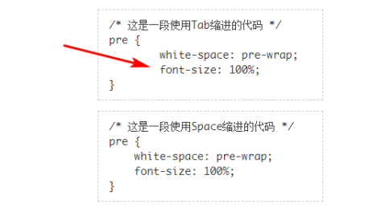

<!-- # 9.3 文本字符的尺寸控制 -->

## 9.3.1 text-size-adjust属性到底有没有用

早年的时候，会通过设置`text-size-adjust:none`解决Chrome浏览器中font-size无法小于12px的问题，例如设置font-size:10px后，最终显示的文字大小却是12px。后来，Chrome浏览器取消了通过设置text-size-adjust:none让文字小于12px的特性。

目前在桌面端浏览器中，text-size-adjust属性确实一无是处，但是在移动端，尤其在`iOS`中，该属性还是有一些应用场景的。

在iPhone的`微信App`或者原生的`Safari浏览器`中，在默认情况下，当手机从竖屏变成横屏的时候，由于页面变宽了，为了让文字阅读更轻松，iPhone会使用算法让文字变大。结果如图9-23所示，竖屏时的文字尺寸一切正常，但是横屏的时候，标题字号和部分正文列表的字号明显增大了。


**图9-23 横屏时的文字放大效果示意**

[**text-size-adjust在iOS Safari下横屏文字放大实例页面**](https://demo.cssworld.cn/new/9/3-1.php)

iPhone这种横屏时字号自动调整的行为就是`text-size-adjust`属性决定的，所以我们只需要在全局设置text-size-adjust属性值为`none`即可，代码如下：

```css
body {
 -webkit-text-size-adjust: none;
}
```

桌面端的Safari浏览器和Firefox浏览器并不支持text-size-adjust属性，并且Chrome浏览器不支持-webkit-私有前缀开头的语法。也就是说，仅有iOS的Safari浏览器支持- webkit-text-size-adjust，不必担心上面的语法会影响其他浏览器。因此，**在移动端的Web开发中，务必设置-webkit-text-size-adjust:none**。

## 9.3.2 使用ch新单位换个心情

`ch`与em、rem和ex一样，是CSS中为数不多和字符相关的相对单位。与单位em和rem相关的字符是“m”，与ex相关的字符是“x”，**和ch相关的字符则是“0”**，没错，就是阿拉伯数字0。**1ch表示1个“0”字符的宽度，所以“000000”所占据的宽度就是6ch。**

由于字符的宽度不仅受字体影响，加粗和倾斜效果也会影响字符的宽度，因此，**ch的尺寸是不固定的**，在不同的浏览器和不同的操作系统中所占据的尺寸是不一样的。所以，**ch单位并不适用于需要精确尺寸的场景**，其设计初衷主要是保证文本内容的阅读体验，并且是为英文阅读设计的。

对于中文阅读，我们可以使用`em`进行宽度指定。例如，我们希望每一行的汉字是`42`个字，以保证最佳阅读体验，则可以设置：

```css
article {
 max-width: 42em;
}
```

但是对于英文，一直没有类似的单位，于是，开发者设计了`ch`单位。例如，在英文阅读中，包括空格在内，每行以60～100个字符为宜，于是我们就可以设置一个比较合理的阅读宽度：

```css
article {
 max-width: 68ch;
}
```

上面的宽度设置还是一种近似的宽度设置，并不表示最终一行真的有68个英文字符，因为字符“i”和字符“m”的宽度都和“0”不一样，除非使用的是等宽字体。因此，**如果想要使用ch单位精准限制字符个数，一定要在等宽字体的场景下使用。**

```css
.font-mono {
  font-family: Menlo, Monaco, Consolas, "Liberation Mono","Courier New", monospace;
}
```

### 不妨试试ch单位

在Web布局中，有非常多的场合并不需要精确的距离和尺寸，此时不妨试试ch单位。

例如，实现一个包含4位验证码字符的验证码输入框，目前的普遍做法是将验证码输入框的宽度设置为80px或者120px等固定的宽度值，此时就可以使用ch单位，如下所示（预留2ch的安全距离）：

```css
input {
  width: 6ch;
}
```

又如，按钮元素左右会预留一点内边距，可以使用ch单位来设置：

```css
button {
  padding: 0 1ch;
}
```

再如，分隔线左右需要有空格大小的外间距，使用ch单位设置就比较合适：

```css
.separator::before {
  content: '|';
  margin: 0 1ch;
}
```

**可以使用ch单位的类似场景还有很多。在尺寸与字符相关且对具体的尺寸值要求不严格的情况下，就可以使用ch单位。**

## 9.3.3 使用tab-size属性控制代码缩进的大小

使用`tab-size`属性可以控制Tab键输入的空格（U+0009）的长度大小。

tab-size属性的语法如下：

```css
tab-size: <integer> | <length>
```

- `<integer>`为整数值。表示Tab键输入的空格的宽度等于几个Space键输入的空格（U+0020）的宽度。例如：

```css
tab-size: 2;
```

表示每个Tab键输入的空格的宽度等同于2个Space键输入的空格的宽度。

- `<length>`为长度值。表示每个Tab键输入的空格的宽度值。例如：

```css
tab-size: 2em;
```

表示每个Tab键输入的空格的宽度等同于2个常规汉字的宽度。

**我们只需要关心属性值`<integer>`，至于属性值`<length>`，大家在日常开发中使用到的概率几乎为0。**

在技术文档中，一定会使用大量的`<pre>`元素来展示程序代码，**因为`<pre>`元素中white-space的属性值是pre，空格不会发生合并，Tab键输入的空格缩进或者Space键输入的空格缩进都可以准确显示出来，方便代码阅读**。但是有一个问题，那就是在所有浏览器中，每个Tab键输入的空格的宽度等同于**8个Space键**输入的空格的宽度，而在编辑器中却不是这样的。在编辑器中，每个Tab键输入的空格的宽度等同于**4个Space键**输入的空格的宽度，这就会导致在`<pre>`元素中使用Tab键缩进的代码产生**过度缩进**的效果。

图9-24上面一段代码中的缩进是使用Tab键输入的空格，下面一段代码中的缩进是使用Space键输入的空格。仔细对比，就会发现两处的空格尺寸没有任何区别。但是，**一旦在页面中渲染出来，使用Tab键输入的缩进距离比在编辑器中显示的要更大一些**，如图9-25中箭头所示。


**图9-24 Tab空格和Space空格在编辑器中并无差异**

<br/>




**图9-25 使用Tab键输入的缩进在页面渲染后距离过大**

<br/>

这显然不是开发者想要的缩进大小。过去，开发者只能通过一些手段，把使用Tab键输入的空格转换成使用Space键输入的空格来解决使用Tab键输入空格的缩进距离过大的问题；现在无须这么麻烦，使用tab-size属性即可实现：

```css
pre {
 -moz-tab-size: 4;
 tab-size: 4;
}
```

[**tab-size与Tab空格缩进实例页面**](https://demo.cssworld.cn/new/9/3-2.php)

**以上案例就是tab-size属性目前唯一的应用场景，即设置源代码展示时使用Tab键输入的空格的缩进距离。**

tab-size属性的出现改变了我们编写代码的习惯。在过去，一些规范指南中推荐使用Space键输入空格，但是现在，毫无疑问，更推荐使用Tab键输入空格。**一是文件尺寸小，二是可以非常方便地控制源代码展示时的缩进距离**，例如，如果展示区域宽度不足，我们可以设置tab-size:2。但是，如果想让4个普通空格变成2个空格的距离，单靠CSS是无能为力的。因此，在CSS重置代码中，必须要加上下面这段CSS代码：

```css
pre {
 -moz-tab-size: 4;
 tab-size: 4;
}
```

### 兼容性

tab-size属性的兼容性如表9-6所示


<br/>

可以看出，现代浏览器很早就支持tab-size属性了。至于IE和Edge浏览器，如果必须要兼容，可以引入一段JavaScript代码进行适配，就是**把使用Tab键输入的空格转换成使用Space键输入的空格**，使用一个正则表达式就可以实现：

```js
str = str.replace(/\t/g, ' ');
```