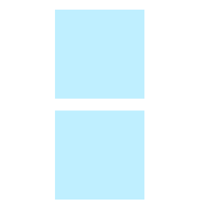

<!-- # 4.1 透明度控制属性opacity -->

`opacity`属性可以让元素表现为半透明，属性计算值范围是`0 ～1`，初始值是`1.0`，没有继承性。

**opacity属性还有很多细节知识：**
- 在所有支持CSS过渡和动画的CSS属性中，`opacity`属性是性能最高的，因此很多动画效果都可以使用`opacity`属性进行性能优化。例如盒阴影动画效果很耗性能，就可以使用伪元素在元素底部创建一个盒阴影，然后使用`opacity`属性控制这个伪元素的显示与隐藏，性能会因此提高很多。（4.3节）
- `opacity`属性值不为1的元素会创建一个层叠上下文，层叠顺序会变高。因此，如果你希望某个DOM顺序在前的元素覆盖后面的元素，可以试试设置`opacity:0.99`

<div style="position:relative">
  <div class="father" style="opacity: 0.99;">
      <p class="son"></p>
  </div>
  <div class="father" style="margin-top: -100px;margin-left: 60px;">
      <p class="son" style="background: red;"></p>
  </div>
</div>

## 4.1.1 opacity属性的叠加计算规则
由于opacity属性没有继承性，因此父、子元素同时设置半透明时，半透明效果是叠加的。例如：
``` css
.father { opacity: .5; }
.son { opacity: .5; }
```

此时，子元素的视觉透明度不是`0.5`，而是一个叠加计算的值，即`0.25`，没错，就是`0.5×0.5`的计算值。下面这个例子可以证明这一点：

::: details 代码实现
``` html
<style>
    .father {
        width: 120px;
    }

    .son {
        height: 120px;
        background: deepskyblue;
    }

    .opacity1,
    .opacity1 .son {
        opacity: 0.5;
    }

    .opacity2 {
        opacity: .25;
    }
</style>

<div class="father opacity1">
    <p class="son"></p>
</div>
<div class="father opacity2">
    <p class="son"></p>
</div>
```
:::

<style>
    .father {
        width: 120px;
    }

    .son {
        height: 120px;
        background: deepskyblue;
    }

    .opacity1,
    .opacity1 .son {
        opacity: 0.5;
    }

    .opacity2 {
        opacity: .25;
    }
</style>

<div>
  <div class="father opacity1">
      <p class="son"></p>
  </div>
  <div class="father opacity2">
      <p class="son"></p>
  </div>
</div>

CSS中半透明颜色和非透明颜色的叠加算法如下：
``` js
r = (foreground.r * alpha) + (background.r * (1.0 - alpha));
g = (foreground.g * alpha) + (background.g * (1.0 - alpha));
b = (foreground.b * alpha) + (background.b * (1.0 - alpha));
```

例如，`deepskyblue`的RGB值是`rgb(0, 191, 255)`，`白色`的RGB值是`rgb(255, 255, 255)`，因此`25% deepskyblue`色值和`白色`的混合值就是：
```js
r = (0 * 0.25) + (255 * (1.0 - 0.25)) = 191.25 ≈ 191;
g = (191 * 0.25) + (255 * (1.0 - 0.25)) = 239;
b = (255 * 0.25) + (255 * (1.0 - 0.25)) = 255;
```

于是，最终呈现的颜色就是`rgb(191, 239, 255)`，这和`图4-1`所示的色值完全一致，详见`图4-2`所示的取色结果。



**图4-1 不同半透明值的对比效果示意**
</>


**图4-2 Photoshop软件中取色结果示意**

## 4.1.2 opacity属性的边界特性与应用
`opacity`属性有一个实用的边界特性，即`opacity`属性设置的数值大小如果超出`0～1`的范围限制，最终的计算值是边界值，如下所示
```css
.example {
 opacity: -999; /* 解析为 0, 完全透明 */
 opacity: -1; /* 解析为 0, 完全透明 */
 opacity: 2; /* 解析为 1, 完全不透明 */
 opacity: 999; /* 解析为 1, 完全不透明 */
}
```

不仅`opacity`属性有边界特性，`RGBA颜色`或者`HSLA颜色`中任意一个颜色通道数值都有边界特性，如下所示：
```css
.example {
 color: hsl(0, 0%, -100%); /* 解析为 hsl(0, 0%, 0%), 黑色*/
 color: hsl(0, 0%, 200%); /* 解析为 hsl(0, 0%, 100%), 白色*/
}
```

这种边界特性配合`CSS变量`可以在CSS中实现类似于`if...else`的逻辑判断，可以用在`元素显隐`或者`色值变化`的场景。

[**案例1：自动配色按钮**](https://demo.cssworld.cn/new/4/1-1.php)

[**案例2：静态饼图**](https://demo.cssworld.cn/new/4/1-2.php)
